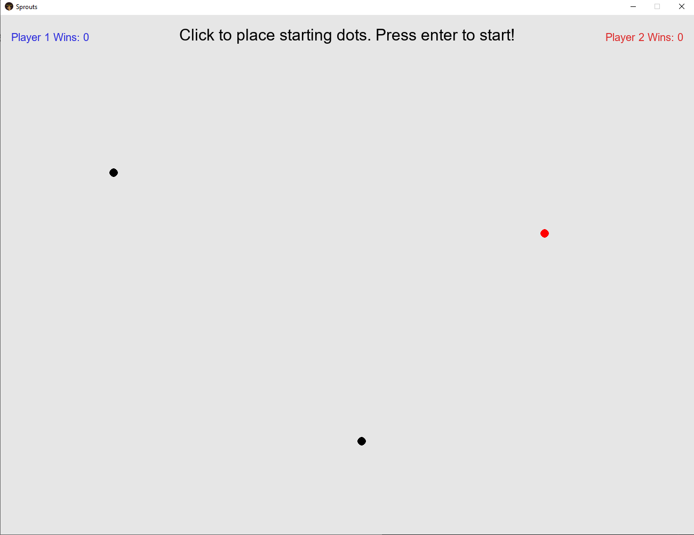
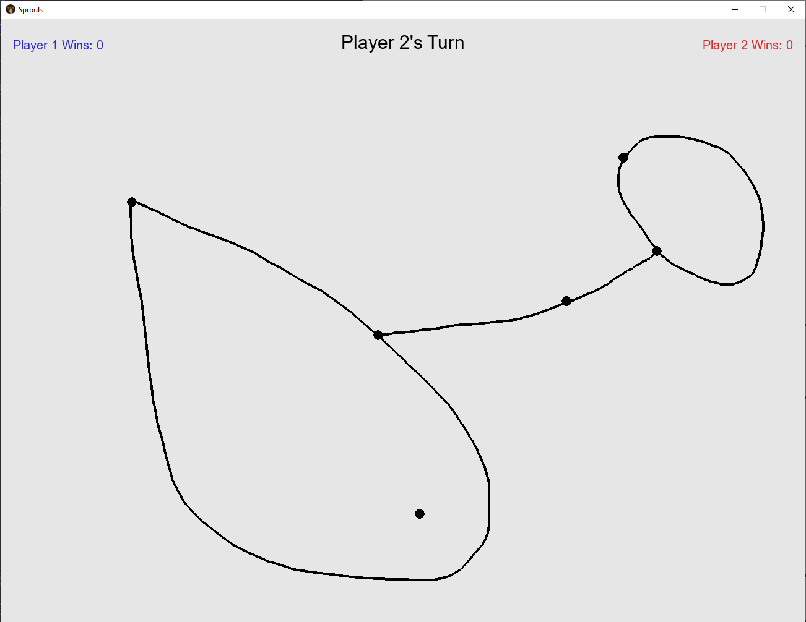
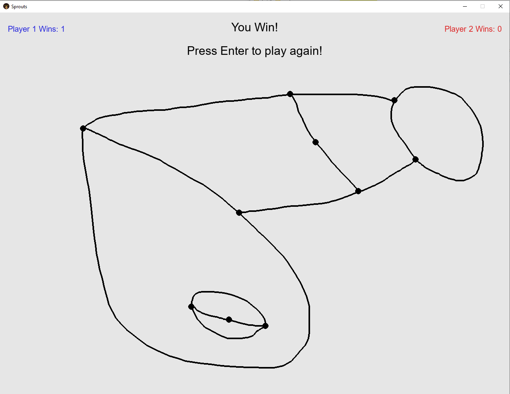
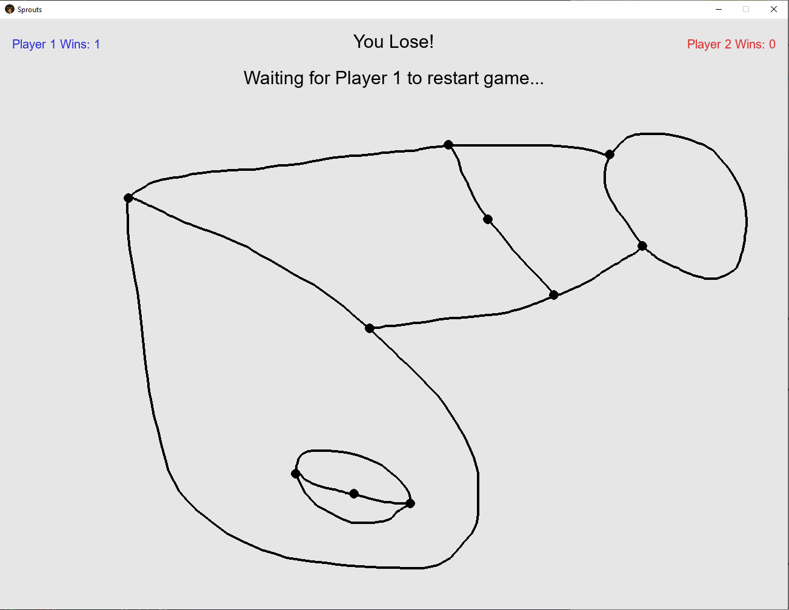

# Sprouts
An online version of the two-player pencil and paper game "Sprouts". For local multiplayer (same computer or network) simply follow the given instructions. For online play (different networks), the host must first forward port 14400 and allow Sprouts through their firewall.

## Screen Shots:

Game Set Up:

Player 2's Turn:

Win Screen:

Lose Screen:

